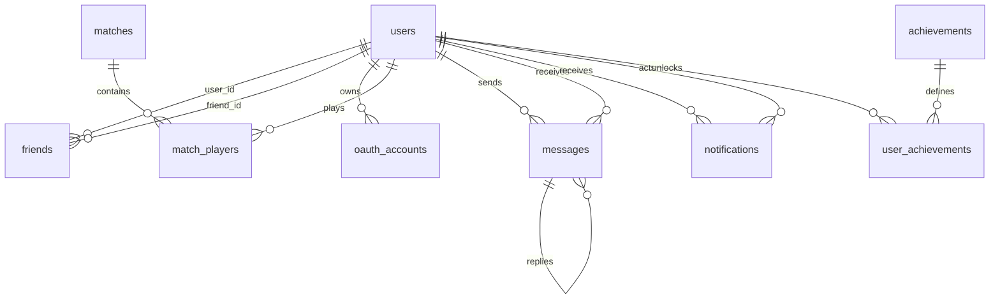

*This project has been created as part of the 42 curriculum by dyarkovs, mperetia, asmolnya, svalchuk*

# Tetra

## Description

**Tetra** is a real-time multiplayer Tetris platform built as the final 42 Common Core web project.

The goal is to provide a complete browser game where users can register, log in, customize game modes, play solo or multiplayer Tetris, interact with other players, track progression, and observe the system through production-style monitoring tools.

Key features:

- Browser-based Tetris with solo presets, quickplay matchmaking, custom rooms, and spectator support.
- Real-time multiplayer with Socket.IO, including remote players and more than two players in the same match.
- User accounts, GitHub OAuth, profiles, avatars, friends, online presence, messages, notifications, achievements, XP, statistics, match history, and leaderboards.
- Responsive React interface with reusable UI components, legal pages, and cross-browser support target.
- PostgreSQL persistence through Prisma ORM.
- Dockerized deployment behind HTTPS Nginx with ELK logging and Prometheus/Grafana monitoring.

## Instructions

### Prerequisites

- Docker and Docker Compose.
- `make`.
- Optional for local development: Node.js `>=22.12.0` and npm `>=10`.
- Local environment file at project root: `.env`.
- TLS certificate files in `tools/`:
  - `tools/transendence.42.fr.crt`
  - `tools/transendence.42.fr.key`

### Environment Setup

Create the local environment file:

```bash
cp .env.example .env
```

Then edit `.env` with real local values. The most important variables are:

- database: `POSTGRES_USER`, `POSTGRES_PASSWORD`, `POSTGRES_DB`, `DATABASE_URL`
- authentication: `JWT_SECRET`
- GitHub OAuth: `GITHUB_CLIENT_ID`, `GITHUB_CLIENT_SECRET`, `GITHUB_CALLBACK_URL`
- application URL: `FRONTEND_URL`
- observability: `ELASTIC_PASSWORD`, `KIBANA_SYSTEM_PASSWORD`, `LOGSTASH_INTERNAL_PASSWORD`, `KIBANA_ENCRYPTION_KEY`, `GRAFANA_ADMIN_PASSWORD`
- HTTPS port: `NGINX_HTTPS_PORT`

### Run With Docker

Build and start the full project with one command:

```bash
make build
```

Default entry point:

```text
https://localhost
```

If port `443` is already used:

```bash
NGINX_HTTPS_PORT=8443 make build
```

Then open:

```text
https://localhost:8443
```

Useful commands:

```bash
make up          # start existing containers
make down        # stop containers and remove volumes
make re          # rebuild and restart
make dev-build   # run the development compose file
```

### Service URLs

- Application: `https://localhost`
- API: `https://localhost/api`
- WebSocket endpoint: `https://localhost/socket.io/`
- Kibana: `https://localhost/kibana`
- Grafana: `https://localhost/grafana`
- Backend health check: `https://localhost/api` through Nginx, or container-local `/health`

### Tests

Backend:

```bash
cd backend
npm test
```

Frontend:

```bash
cd frontend
npm test
npm run lint
npm run build
```

## Team Information

| Login | Member | Assigned role(s) | Responsibilities |
| --- | --- | --- | --- |
| `mperetia` | Mariia Peretiatko | Product Owner, Frontend Lead, Developer | Product flow, React UI, reusable components, profile/statistics screens, legal pages, gameplay views, frontend integration with sockets and API. |
| `dyarkovs` | Daria Yarkovska | Project Manager, Game/Realtime Developer | Team coordination, Tetris engine work, Socket.IO game events, quickplay/custom room flow, multiplayer synchronization, spectator flow. |
| `asmolnya` | Aleksandra Smolniakova | DevOps Lead, Developer | Docker infrastructure, Nginx HTTPS proxy, ELK stack, Prometheus/Grafana monitoring, log retention and dashboards. |
| `svalchuk` | Severyn Valchuk | Backend/User Management Developer | Authentication, Prisma API work, profile/search/friends/messages/notifications backend, validation, database relations. |

## Project Management

The team divided the project by product areas: frontend/game UI, game engine and realtime backend, user management/API/database, and infrastructure/observability. Work was organized through Git branches, pull requests/merge commits, regular sync meetings, and direct communication for integration blockers.

Communication channels used:

- Discord and in-person meetings for planning, integration, and debugging.
- Git commits and branch history for implementation tracking.
- Shared module checklist from the subject to track required points.

Coordination practices:

- features were divided into small tasks before implementation;
- shared contracts such as sockets, auth, and database schema were discussed before final wiring;
- risky changes were reviewed by at least one teammate;
- automated unit/integration tests and manual browser checks were used where applicable.


## Technical Stack

### Frontend

- React 19 with TypeScript
- Vite
- React Router
- Sass/SCSS
- Socket.IO client
- Vitest and Testing Library

React was chosen because the application has many stateful interactive screens: authentication, menus, rooms, game boards, profiles, leaderboards, social panels, and realtime notifications.

### Backend

- Node.js with TypeScript
- Express 5
- Socket.IO
- Prisma ORM
- JWT authentication, bcrypt password hashing, GitHub OAuth
- Zod validation for game configuration
- Jest and Supertest

Express handles HTTP APIs, while Socket.IO handles low-latency bidirectional game, room, presence, and notification events.

### Database

- PostgreSQL
- Prisma schema and generated client

PostgreSQL was chosen for relational integrity between users, OAuth accounts, friends, matches, match players, messages, notifications, and achievements.

### Infrastructure

- Docker Compose for one-command deployment
- Nginx as HTTPS reverse proxy for frontend, API, WebSockets, Kibana, and Grafana
- ELK stack: Elasticsearch, Logstash, Kibana, Filebeat
- Prometheus, Grafana, node-exporter, nginx-exporter, and cAdvisor

## Database Schema



Main tables:

- `users`: identity, email, username, password hash, avatar, country, XP, level, wins, play time, creation date.
- `oauth_accounts`: external provider accounts linked to users.
- `friends`: pending, accepted, and blocked relationships.
- `matches`: game session records with status and game mode.
- `match_players`: per-player match results, scores, metric value, lines, pieces, holds, drops, combos, tetrises, duration, and win/loss result.
- `messages`: persisted direct messages, replies, read state, and timestamps.
- `notifications`: user notifications with actor, type, title, body, JSON payload, and read state.
- `achievements`: achievement catalog.
- `user_achievements`: unlocked achievements per user.

Important enum types:

- `friend_status`: `pending`, `accepted`, `blocked`
- `match_status`: `active`, `finished`
- `player_result`: `win`, `lose`, `draw`
- `gamemode`: `quickPlay`, `fortyLines`, `blitz`, `zen`, `customGame`

## Features List

| Feature | Members | Description |
| --- | --- | --- |
| Authentication | `svalchuk`, `mperetia` | Register/login flow, JWT sessions, password hashing, protected frontend routes. |
| GitHub OAuth | `svalchuk`, `mperetia` | OAuth redirect/callback/exchange flow and frontend callback handling. |
| Profiles and avatars | `mperetia`, `svalchuk` | Public profile pages, profile update API, avatar selection/default avatar. |
| Friends and online status | `svalchuk`, `mperetia` | Friend requests, accept/reject/remove/block actions, realtime online presence. |
| Messaging | `svalchuk`, `dyarkovs`, `mperetia` | Persistent direct messages, conversations, read state, message notifications. |
| Notifications | `svalchuk`, `mperetia` | Notification storage, read/unread state, realtime notification delivery. |
| Tetris engine | `dyarkovs`, `mperetia` | Board state, pieces, input handling, gravity, hold, scoring, line clear logic. |
| Solo modes | `mperetia`, `dyarkovs` | Zen, 40 Lines, Blitz, and configurable local gameplay presets. |
| Quickplay multiplayer | `dyarkovs`, `mperetia` | Lobby, matchmaking-style entry, remote realtime matches, game-over/result flow. |
| Custom multiplayer rooms | `dyarkovs`, `mperetia` | Room creation/joining, host start, configurable settings, multiplayer board views. |
| 3+ player multiplayer | `dyarkovs`, `mperetia` | More than two players can join and play in synchronized multiplayer rooms. |
| Spectator mode | `dyarkovs`, `mperetia` | Users can observe ongoing quickplay/multiplayer game state in realtime. |
| Game customization | `mperetia`, `dyarkovs` | Board size, bag type, hold, preview pieces, gravity, garbage, targeting, modifiers. |
| Progression and achievements | `mperetia`, `dyarkovs`, `svalchuk` | XP, levels, achievement catalog, unlock tracking, visual XP feedback. |
| Statistics and match history | `mperetia`, `svalchuk` | User statistics, match records, wins/losses, leaderboard integration. |
| Leaderboards | `mperetia`, `svalchuk` | Mode/scope leaderboard endpoint and channel UI. |
| Legal pages | `mperetia` | Privacy Policy and Terms of Service accessible from the footer. |
| Design system | `mperetia` | Reusable components such as Button, Dialog, Confirm, Toast, GameBoard, ProfileHeader, SocialPanels, NotificationsPanel, ModeLayout, ModeOptions, StateView, BackButton, ChannelButton. |
| ELK logging | `asmolnya` | Nginx JSON logs collected by Filebeat/Logstash, indexed in Elasticsearch, displayed in Kibana. |
| Monitoring | `asmolnya` | Prometheus metrics, exporters, cAdvisor, Grafana provisioning, dashboards and alerts. |
| HTTPS deployment | `asmolnya`, `svalchuk` | Nginx TLS reverse proxy for frontend, API, WebSocket, Kibana, and Grafana routes. |

## Modules

The subject requires at least 14 points. This implementation targets **27 points**.

| Category | Module | Type | Points | Implementation | Members |
| --- | --- | --- | ---: | --- | --- |
| Web | Use a framework for frontend and backend | Major | 2 | React frontend and Express backend. | `mperetia`, `svalchuk`, `dyarkovs` |
| Web | Real-time features with WebSockets | Major | 2 | Socket.IO game, room, presence, notification, and social events. | `dyarkovs`, `mperetia` |
| Web | User interaction | Major | 2 | Chat/messages, profiles, friends list, friend requests, online status. | `svalchuk`, `mperetia` |
| Web | Use an ORM | Minor | 1 | Prisma ORM with PostgreSQL schema and generated client. | `svalchuk` |
| Web | Notification system | Minor | 1 | Persistent notifications plus realtime delivery for social/message events. | `svalchuk`, `mperetia` |
| Web | Custom design system | Minor | 1 | More than 10 reusable UI components and shared styling conventions. | `mperetia` |
| Accessibility and Internationalization | Additional browser support | Minor | 1 | UI and gameplay target Chrome plus additional modern browsers such as Firefox and Edge. | `mperetia` |
| User Management | Standard user management and authentication | Major | 2 | Secure account flow, profile update, avatar/default avatar, friends, profile pages, online status. | `svalchuk`, `mperetia` |
| User Management | Game statistics and match history | Minor | 1 | Match records, per-player metrics, statistics page, achievements/progression, leaderboard data. | `mperetia`, `svalchuk` |
| User Management | OAuth 2.0 remote authentication | Minor | 1 | GitHub OAuth account linking/login flow. | `svalchuk`, `mperetia` |
| Gaming and UX | Complete web-based game | Major | 2 | Browser Tetris with rules, scoring, win/loss state, solo and multiplayer views. | `dyarkovs`, `mperetia` |
| Gaming and UX | Remote players | Major | 2 | Separate clients play the same game through Socket.IO synchronization. | `dyarkovs`, `mperetia` |
| Gaming and UX | Multiplayer game with more than two players | Major | 2 | Custom/quickplay multiplayer supports 3+ simultaneous players. | `dyarkovs`, `mperetia` |
| Gaming and UX | Game customization options | Minor | 1 | Presets, board dimensions, piece bag, hold, preview, gravity, garbage, targeting, modifiers. | `mperetia`, `dyarkovs` |
| Gaming and UX | Gamification system | Minor | 1 | Achievements, XP/level progression, leaderboard, visual XP feedback. | `mperetia`, `dyarkovs`, `svalchuk` |
| Gaming and UX | Spectator mode | Minor | 1 | Users can subscribe to quickplay/multiplayer game updates as spectators. | `dyarkovs`, `mperetia` |
| DevOps | ELK log management | Major | 2 | Elasticsearch, Logstash, Kibana, Filebeat, Nginx JSON logs, index/snapshot policies. | `asmolnya` |
| DevOps | Prometheus and Grafana monitoring | Major | 2 | Prometheus config, Grafana dashboards/provisioning, alerts, node/nginx/cAdvisor exporters. | `asmolnya` |

### Point Calculation

- Web: `2 + 2 + 2 + 1 + 1 + 1 = 9`
- Accessibility: `1`
- User Management: `2 + 1 + 1 = 4`
- Gaming and UX: `2 + 2 + 2 + 1 + 1 + 1 = 9`
- DevOps: `2 + 2 = 4`

Total: `9 + 1 + 4 + 9 + 4 = 27 points`

## Individual Contributions

### `mperetia` - Mariia Peretiatko

- Built major parts of the React frontend: routing, protected pages, layout, play menu, game views, profile/statistics/leaderboard/achievements pages, legal pages, and reusable UI components.
- Integrated frontend API calls and Socket.IO events for authentication, gameplay, profile, social panels, notifications, and progression feedback.
- Worked on game UI/UX, custom mode configuration, game board display, result screens, and visual polish.
- Challenge: keeping realtime game state, frontend navigation, and protected sessions synchronized without confusing users after reconnects or route changes.

### `dyarkovs` - Daria Yarkovska

- Worked on the Tetris engine, game state, multiplayer room behavior, quickplay flow, custom game flow, and Socket.IO game handlers.
- Implemented realtime event contracts for joining/leaving modes, starting rooms, moving pieces, game resume/stop, lobby updates, and spectator entry.
- Helped connect engine behavior with match lifecycle and multiplayer synchronization.
- Challenge: making multiple clients receive consistent state while handling disconnects, replacement sockets, and player roles.

### `asmolnya` - Aleksandra Smolniakova

- Built and configured Docker infrastructure for production-style deployment.
- Implemented Nginx HTTPS reverse proxy, ELK stack, log collection pipeline, Kibana setup, retention/index policies, and snapshot-related checks.
- Added Prometheus/Grafana monitoring with dashboards, alerts, and exporters.
- Challenge: making observability services work together inside Docker while keeping access routed through HTTPS.

### `svalchuk` - Severyn Valchuk

- Implemented backend API areas around authentication, profile, search, friends, messages, notifications, and database relations.
- Worked on Prisma/PostgreSQL schema evolution and service functions for user management and social features.
- Added backend validation and tests for core API behavior.
- Challenge: keeping relational data consistent across social actions such as friend requests, blocking, message delivery, read states, and notifications.

## API Overview

Main HTTP routes include:

Auth:
- `POST /api/auth/register`
- `POST /api/auth/login`
- `GET /api/auth/github`

OAuth:
- `GET /api/auth/github/callback`
- `POST /api/auth/github/exchange`
- `GET /api/auth/me`

users/profile:
- `GET /api/users/search`
- `GET /api/users/:username/profile`
- `PATCH /api/users/me/profile`
- `PATCH /api/users/me/password`

friends:
- `GET /api/friends`
- `POST /api/friends/request`
- `POST /api/friends/respond`
- `POST /api/friends/remove`
- `POST /api/friends/block`

messages:
- `GET /api/messages/conversation/:friendId`
- `POST /api/messages`
- `PATCH /api/messages/:id/read`

notifications:
- `GET /api/notifications`
- `PATCH /api/notifications/read`

game/progression:
- `GET /api/leaderboards`
- `GET /api/achievements`

Main Socket.IO events include:

rooms/modes:
- `mode:join`
- `mode:leave`
- `rooms:list`
- `rooms:update`
- `room:start`
- `room:update`

quickplay:
- `quickplay:lobby`
- `quickplay:spectate`

game:
- `player:move`
- `game:start`
- `game:update`
- `game:resume`
- `game:end`
- `game:stop`

rounds:
- `round:start`
- `round:end`

social/system:
- `social:update`
- `notifications`
- `server:error`

## Privacy and Terms

The application includes accessible legal pages:

- Privacy Policy: `/privacy-policy`
- Terms of Service: `/terms-of-service`

Both pages are linked from the application footer and contain project-specific content about accounts, gameplay, chat/messages, profiles, leaderboards, OAuth, data storage, security, fair play, and availability.

## Known Limitations

- The HTTPS certificate is local/self-signed, so browsers may require manual trust.
- Observability containers need enough Docker memory, especially Elasticsearch and Grafana.
- The project is a 42 student project and is not intended for production or commercial use.
- Claimed modules should be demonstrated through the running application during evaluation.

## Resources

Project references:

- React documentation: https://react.dev/
- Vite documentation: https://vite.dev/
- React Router documentation: https://reactrouter.com/
- Express documentation: https://expressjs.com/
- Socket.IO documentation: https://socket.io/docs/
- Prisma documentation: https://www.prisma.io/docs
- PostgreSQL documentation: https://www.postgresql.org/docs/
- Docker Compose documentation: https://docs.docker.com/compose/
- Nginx documentation: https://nginx.org/en/docs/
- Elasticsearch documentation: https://www.elastic.co/guide/
- Kibana documentation: https://www.elastic.co/guide/en/kibana/
- Logstash documentation: https://www.elastic.co/guide/en/logstash/
- Filebeat documentation: https://www.elastic.co/guide/en/beats/filebeat/
- Prometheus documentation: https://prometheus.io/docs/
- Grafana documentation: https://grafana.com/docs/
- Web Content Accessibility Guidelines: https://www.w3.org/WAI/standards-guidelines/wcag/
- OAuth 2.0 overview: https://oauth.net/2/
- OWASP Password Storage Cheat Sheet: https://cheatsheetseries.owasp.org/cheatsheets/Password_Storage_Cheat_Sheet.html
- Tetris Wiki: https://tetris.wiki/
- TETR.IO Wiki: https://tetrio.wiki.gg/

### AI Usage

AI tools were used as support for documentation, code review prompts, debugging ideas, test-case brainstorming, and README organization. For this README, AI was used to summarize the subject requirements, compare them with the repository structure, and draft a clear English document.

AI-generated suggestions were reviewed against the actual codebase before inclusion. The team remains responsible for understanding, explaining, testing, and maintaining every implemented feature.
